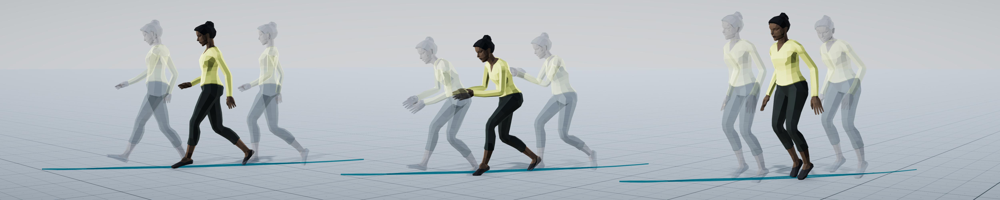

# MoGlow: Probabilistic and controllable motion synthesis using normalising flows
Gustav Eje Henter\*, Simon Alexanderson\* and Jonas Beskow

All from KTH Royal Institute of Technology

\*) Joint first authors

---

MoGlow is a new deep-learning architecture for creating high-quality animation. Its key advantages include:

1. It is *general*. Unlike most prior work in motion generation, the same method works for generating a wide variety of motion types, such as diverse human locomotion, dog locomotion, and arm and body gestures driven by speech.

2. It is *controllable*: Output motion can be conditioned on an arbitrary control input, such as which direction to walk, used to achieve interactive control over the output motion without algorithmic latency.

3. It is *probabilistic*, and learns an entire distribution of plausible output motions that are consistent with the desired control.

Evaluations show that MoGlow produces convincingly natural motion and approaches state-of-the-art performance on each application we tested it on – despite the fact that MoGlow is completely general and free from task-specific assumptions, whereas each state-of-the-art method is custom-designed for a single task only. The approach has won and been nominated for several awards.

### Video
<iframe width="560" height="315" src="https://www.youtube.com/embed/pe-YTvavbtA" frameborder="0" allow="accelerometer; autoplay; encrypted-media; gyroscope; picture-in-picture" allowfullscreen></iframe>

### Additional resources
* [Our main paper](https://dl.acm.org/doi/10.1145/3414685.3417836) was presented at SIGGRAPH Asia and published in ACM ToG 2020 and is [also available on arXiv](https://arxiv.org/abs/1905.06598).

* [Code and motion data are publicly available on GitHub](https://github.com/simonalexanderson/StyleGestures).

* [Follow-up work published at EUROGRAPHICS 2020](https://youtu.be/egf3tjbWBQE) adds style control and applies the method to gesture generation.

* [Follow-up work published at IVA 2020](https://patrikjonell.se/projects/lets_face_it/) applies similar ideas to generate facial expressions in response to a conversation partner.

* [Another follow-up work published at IVA 2020](https://simonalexanderson.github.io/IVA2020/) combines the method with spontaneous speech synthesis to create speech and full-body gestures from text input alone.

### Citing

@article{henter2020moglow,
  author = {Henter, Gustav Eje and Alexanderson, Simon and Beskow, Jonas},
  doi = {10.1145/3414685.3417836},
  journal = {ACM Transactions on Graphics},
  number = {4},
  pages = {236:1--236:14},
  publisher = {ACM},
  title = {{M}o{G}low: {P}robabilistic and controllable motion synthesis using normalising flows},
  volume = {39},
  year = {2020}
}

